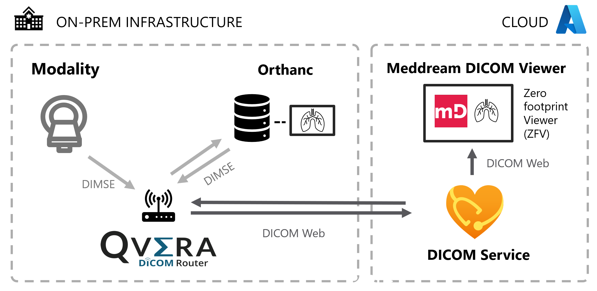

# Azure Health Data Service - DICOM service demo environment

_This guide is intended to be used after deploying the demo environment to Azure.  See the instructions in the [README](README.md#deploying-the-infrastructure)._

This demo environment is used to simulate a sample hospital imaging network and demonstrate how such a network could be connected to the Azure Health Data Services DICOM service.

## Get oriented with the demo infrastructure
If this is your first time using this demo environment, it's a good idea to get acquianted with the main components of the simulated on-prem infrastructure.  There are several interesting components as shown in the following diagram: 

First, note the two dashed-line boxes - these areas show the components running in the two portions of the simulated infrastructure: On-prem and Cloud.

### On-prem infrastructure
The simulated on-prem infrastructure is a greatly simplified example of a hospital's radiology IT infrastructure, including the following systems:

1. **A PACS system containing sample DICOM images**.  [Orthanc](https://www.orthanc-server.com/), is the sample PACS system, with imaging data pre-loaded from the National Cancer Institute’s [Imaging Data Commons](https://portal.imaging.datacommons.cancer.gov/).  The Azure container named `contoso-orthanc-containergroup` is where the Orthanc server is running.
2. **A DICOM router to route imaging data**.  [Qvera Interface Engine (QIE)](https://www.qvera.com/hl7-interface-engine/) is the DICOM router used in this demo environment.  The Azure container named `contoso-qvera-containergroup` is where the QIE router is running.
3. **A Simulated Modality**.  A set of scripts will be used to "generate" new DICOM images, simulated those coming from a CT, MRI, X-ray, etc.
4. **A Jump VM connected to the on-prem network** _(not pictured)_.  This virtual machine is used to access and configure the PACS system and the DICOM router.  This machine also hosts the scripts used to simulate new DICOM images coming from a modality.

### Cloud infrastructure
The cloud infrastructure contains two additional systems that interact with the on-prem infrastructure:

1. **DICOM service**.  The DICOM service is deployed in an Health Data Services (HDS) workspace and will be used to store DICOM images sent from the on-prem environment.  The Health Data Services workspace will have a name in the format `workspace{randomsuffix}` and the corresponding DICOM service will be similarly named `dicom{randomsuffix}`. 
2. **Zero Footprint (ZFP) viewer**.  The ZFP viewer is a web-based DICOM viewer that allows users to view images in their browser without installing anything on their local machine.  [MedDream](https://www.softneta.com/products/meddream-dicom-viewer/) is the ZFP viewer used in this demo environment.  The Azure container named `meddreamContainerGroup` is where the MedDream viewer is running.

## View images in the PACS
1. Open the Edge browser and navigate to http://portal.azure.com.  
2. Select **Resource Groups** from the Azure services menu.  
3. Select the resource group that you selected in the deployment template.  
4. The overview page lists all resources in the resource group.  Note the container instances for the applications listed above as well as additional storage and networking components needed to simulate the network. 
    
5. Select the **jump-vm** virtual machine.  You will connect to this virtual machine to simulate viewing the PACS from within the network.
6. Download the Remote Desktop RDP file.
    1. Select **Connect** under the Settings section.
    2. Change the **Port number** to **4545** and select **Download RDP file**.
    
    3. When the download is complete, open the **jump-vm.rdp** file to connect to the virtual machine.
7. Log in to the virtual machine.
    1. In the Remote Desktop Connection dialog, dismiss any warnings and click **Connect**.
    2. When prompted to log in, select **More choices** then **Use a different account** to type your own credentials.
    3. In the email section, enter "**student**" and then enter the resource group **admin password** entered during the deployment.  
    4. If prompted with a certificate warning, select **Yes** to connect.
    5. Select **Accept** to accept the default privacy settings.
    6. Select **Yes** on the Network flyout to allow the machine to be discoverable on the virtual network.
8. Populate the PACS with sample data.
    1. On the desktop, locate the file named `1-preload-orthanc` and double-click to run the script.  This script copies sample DICOM data to Orthanc and will preload eight total studies for eight different patients.
9. Log in to the PACS.  
    1. Open the Edge browser and navigate to http://10.0.2.4:8042/ or use the **Orthanc** shortcut on the desktop.  This is the local network address for Orthanc.
    2. Enter "**student**" for both the username and password.
10.	Browse to a series
    1. Select **All studies** to see the list of studies available in the PACS (Orthanc).
    
    2. Select a study from the list to view the study details.
    
    3. Select a series from the list to view the series details.
    
11. Select the **Osimis Web Viewer** option to see the image.
    

## Simulate a new study from a modality
To simulate modalities that are producing new imaging studies, we will use a local script that sends DICOM data to the PACS.  These new studies are from November 2022.
1. On the desktop, locate the file named `2-modality-pushing-to-orthanc`.
2. Double-click the file to run the script and send the new study to the PACS.
3. Browse to the **All Patients** view in Orthanc to see the changes.  Three patients will now have two studies, the latest of which is dated November 2022.

## Add a DICOM router to the network
Connecting the DICOM service to the existing network requires the configuration of a DICOM router and this demo uses Qvera Interface Engine (QIE).  The configuration will send new imaging from modalities to the DICOM router which will then send that data to both the PACS and the DICOM service.  
1. Navigate to http://10.0.1.4:80 or use the **QveraInterfaceEngine** shortcut on the desktop.  This is the local address for QIE.
2. When prompted to log in to QIE, use the default admin credentials and select **Login**.
3. When prompted, change the password to one you can remember.  
4. After chaging the password, you will need to enter your license ID.  If you do not have one already, you can [get a trial license from Qvera](https://www.qvera.com/qie-registration-ent/).  
5. When prompted, input the **License ID** and the **Activation code** and select **Get License**.
    
6. Select **Save** on the License dialog and select **OK** on the About screen.
7. Import the router configuration.  This configuration contains the default routing rules for the simulated network and some functions specific to the DICOM service.  
    1. From the top menu bar, select **Application `>` Import Configuration**.
    
    2. In the Open QIE Configuration File dialog, use the ellipsis (…) button to select the configuration file.  Browse to the desktop and select `qie_MicrosoftDICOM_20221123.qie`.  Select **Open** to open the config file.
    3. In the Import Configuration dialog, select the **checkbox next to the MicrosoftDICOM** zone to import all channels.
    4. Select the **Import Sample Messages** option and select **Import**.
    
8. Before QIE can connect to the DICOM service, you will need to [register a client application with AAD](https://learn.microsoft.com/azure/healthcare-apis/dicom/dicom-register-application).  

    > Make note of the **application ID** and **client secret** when registering the client application.
    > 
    > Also, note the authorization URL from the **Endpoints** pane on the Overview page.  You'll need the **OAuth 2.0 token endpoint (v1)**

9. Configure the web service connection.  This enables the router to communicate with the DICOM service.  
    1. Select the **MicrosoftDICOM** zone to expand the zone details.
    
    2. Select **Web Service Connections** and then **MicrosoftDICOMWeb**.
    
    3. In the **Endpoint** URL box, enter the **DICOM service URL**.  You can find the URL in the Azure portal by browsing to **Resource Groups `>` rsna_workshop_studentN `>` DICOM Service `>` Overview `>` Service URL**.  
    
        > The service URL will be in a format like, https://myws-mydicom.dicom.azurehealthcareapis.com

        

    4. In the **Username** box, enter in the **Application ID** from the Azure Active Directory app registration process.  This is the ID the router uses to authenticate to the DICOM service.  
    5. In the **Password** box, enter in the **Client secret** from the app registration process.  This is the client secret that is used to generate authentication tokens.  
    6. In the **Auth URL** box, enter in the **Auth URL** for the DICOM service. 

        > The auth URL should be in a format like, https://login.microsoftonline.com/0a0a0a0a-20ac-4545-9999-6ef19807994e/oauth2/token

    7. From the menu bar, select **Save** to save the web service connection.
    8. Test the connection by selecting the **Test OAuth** button (you may need to scroll down).  

        
    
        > In the test log, you should see a 200 OK response and “Bearer” token returned by the service.

        

10. Test the connection to the PACS system (Orthanc).  This ensures the connection from the router to the PACS system is working correctly.